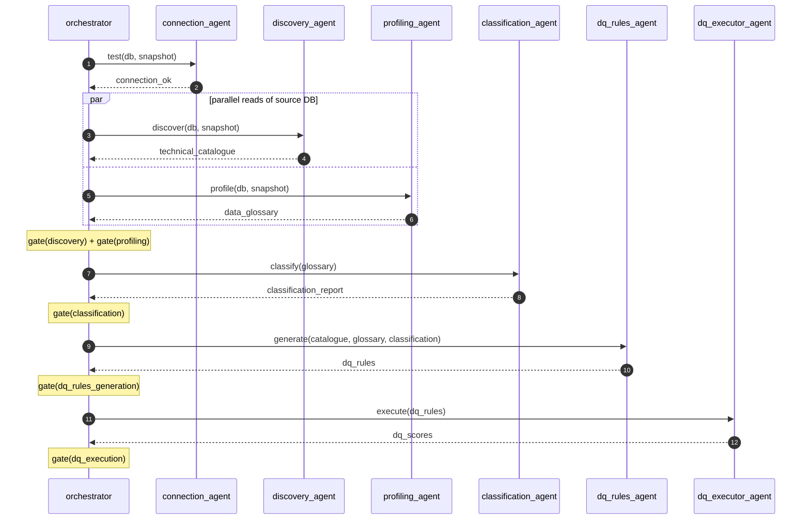

# Autonomous Data Governance Assistant

An agentic data-quality and governance platform built with FastAPI. A small
team of LLM-powered agents collaborates to **discover, profile, classify,
generate DQ rules, execute them, and trend the results** across multiple
data snapshots — all served behind a single FastAPI app with rich Swagger UI.

The reference dataset is a synthetic mortgage / home-loan SQLite database
(`branches`, `loan_officers`, `customers`, `applications`, `loans`,
`collaterals`, `payments`, `credit_history`) that supports multi-snapshot
loading so you can analyse data quality drift over time.

---

## Hackathon quickstart

The platform is designed to satisfy the agentathon non-negotiable
constraints: a single command boots a service on port 8000 that exposes a
single `POST /run` endpoint, auto-loads the bundled sample dataset, and
executes the entire agent pipeline end-to-end.

```bash
# 1. Install dependencies (CPU-only, no GPU required)
pip install -r requirements.txt

# 2. Provide your Compass API key. Either:
#    a) export COMPASS_API_KEY=...   (preferred for CI / organizers)
#    b) cp .env.example .env  and edit COMPASS_API_KEY=...
#    c) for local dev: keep MODE=local and put the key in `.env.local`

# 3. Boot the service on port 8000
python run.py

# 4. From another terminal, run the pipeline end-to-end (no manual setup)
curl -X POST http://localhost:8000/run \
     -H "Content-Type: application/json" \
     -d '{"db_name":"mortgage_demo","snapshot_date":"2025-01-01"}'
```

Sample payloads live under [input_examples/](input_examples/) and
[output_examples/](output_examples/) (3 inputs + 3 outputs + a bonus trend
example). Submission metadata is declared in [metadata.json](metadata.json).

### Submission constraints — compliance map

| Constraint | Where it's met |
|---|---|
| Compass API integration | [app/utils/llm_client.py](app/utils/llm_client.py) (OpenAI client pointed at `https://api.core42.ai/v1`) |
| `run.py` + `POST /run` on port 8000 | [run.py](run.py), [app/main.py](app/main.py) |
| Runtime ≤ 15 min | discovery + profiling parallelised in [app/agents/orchestrator.py](app/agents/orchestrator.py) |
| Static data ≤ 500 MB | bundled sample DB regenerated on demand by `create_mortgage_database`; total repo well under cap |
| No API keys committed | `.env` is gitignored; real keys go in `.env.local` (also gitignored) |
| `.env.example` for organizers | [.env.example](.env.example) |
| Logs saved | [logs/](logs/) (per-agent + access + app, rotating) |
| ≥3 input + ≥3 output examples | [input_examples/](input_examples/), [output_examples/](output_examples/) |
| `metadata.json` | [metadata.json](metadata.json) |
| CPU only | pure-Python stack (FastAPI + sqlite3 + OpenAI HTTP client) |
| Automated data loading | `POST /run` calls `setup_database=True` which invokes `create_mortgage_database` automatically |

---

## Features

- **Snapshot-aware data model** — every fact table carries a `report_date`
  column. The same database can hold many snapshots side-by-side; agents and
  endpoints always operate on a `(db_name, snapshot_date)` pair.
- **Multi-agent pipeline** orchestrated end-to-end via `/api/v1/pipeline/run`:
  - `connection_agent` — connectivity smoke test
  - `discovery_agent` — technical catalogue (tables, columns, FKs) **(runs in parallel with profiling)**
  - `profiling_agent` — column-level profiling + business glossary **(runs in parallel with discovery)**
  - `classification_agent` — PII / sensitivity classification
  - `dq_rules_agent` — generate DQ rules from catalogue + glossary
  - `dq_executor_agent` — run rules against the snapshot, score by
    dimension (Accuracy, Completeness, Consistency, Timeliness, Validity,
    Uniqueness)
  - `qa_agent` — natural-language Q&A scoped to a `(db, snapshot, table)`
- **Inter-agent completeness gates** — between every pipeline stage the
  orchestrator scores the upstream agent's artifact (0..1) with a
  deterministic, rule-based check. If the score is below
  `COMPLETENESS_THRESHOLD` (default `0.8`) the issues are published to the
  agent logs and the pipeline halts before the next agent runs, so a
  degraded artifact never feeds downstream. See
  [app/utils/completeness.py](app/utils/completeness.py).
- **Trend analysis** — `/api/v1/dq-scores/trend` summarises DQ-score movement
  across a date range using GPT-5.1 (overall, per-dimension, per-table,
  findings, risks, recommendations).
- **Per-snapshot, per-database isolation** — artifacts are persisted in a
  central `dq_admin.db` registry keyed on `(db_name, snapshot_date, kind)`
  with UPSERT semantics: re-running an agent for the same snapshot
  overwrites that snapshot's artifact; a new snapshot date appends.
- **Rich Swagger UI** with cascading dropdowns: `db_name` filters the
  `snapshot_date` / `snapshot_date_start` / `snapshot_date_end` selects to
  the snapshots that exist for the chosen database.
- **Per-agent log files** under `app/logs/agents/<agent>.log`, plus a unified
  `app.log` and an `api_access.log` for every HTTP request.
- **Agent-interaction transcript** at `logs/agents/interactions.log` — one
  JSON line per inter-agent event (`handoff`, `gate`, `halt`) so the
  conversation between agents is fully reconstructible. See
  [Agent interactions](#agent-interactions).
- **Two-mode secrets handling** — `.env` is the committed template with a
  `<COMPASS_API_KEY>` placeholder; real secrets live in a gitignored
  `.env.local` and are loaded automatically when `MODE=local`.

---

## Project structure

```
agentathon/
├── app/
│   ├── main.py                       # FastAPI app + custom Swagger UI
│   ├── agents/                       # LLM-driven agents
│   │   ├── orchestrator.py
│   │   ├── connection_agent.py
│   │   ├── discovery_agent.py
│   │   ├── profiling_agent.py
│   │   ├── classification_agent.py
│   │   ├── dq_rules_agent.py
│   │   ├── dq_executor_agent.py
│   │   └── qa_agent.py
│   ├── api/routes/                   # FastAPI routers (one per concern)
│   │   ├── database.py
│   │   ├── connection.py
│   │   ├── discovery.py
│   │   ├── profiling.py
│   │   ├── classification.py
│   │   ├── dq_rules.py
│   │   ├── dq_scores.py              # incl. /trend (GPT-5.1)
│   │   └── pipeline.py
│   ├── config/
│   │   ├── settings.py               # Pydantic settings, MODE-aware env loader
│   │   └── connections.yaml
│   ├── database/
│   │   ├── setup_mortgage_sample_db.py   # default sample loader
│   │   └── setup_sample_db.py            # legacy e-commerce loader
│   ├── models/                       # Pydantic schemas (catalogue, dq_rules, …)
│   ├── utils/
│   │   ├── db_registry.py            # dq_admin.db: DBs, snapshots, artifacts
│   │   ├── db_utils.py               # snapshot-aware SQL helpers
│   │   ├── llm_client.py             # Compass API wrapper (GPT-4.1 / GPT-5.1)
│   │   ├── logging_config.py         # rotating file handlers per agent
│   │   └── prompts.py
│   └── outputs/                      # generated JSON/MD artifacts
├── input_examples/                   # ≥3 sample request payloads
│   ├── input_1_run.json
│   ├── input_2_pipeline_run.json
│   └── input_3_qa_ask.json
├── output_examples/                  # ≥3 sample response payloads (+ trend)
│   ├── output_1_run.json
│   ├── output_2_pipeline_run.json
│   ├── output_3_qa_ask.json
│   └── output_4_trend.json
├── logs/                             # rotating log files (gitignored)
│   ├── app.log
│   ├── api_access.log
│   └── agents/<agent>.log
├── run.py                            # mandatory entry point → :8000
├── metadata.json                     # mandatory submission metadata
├── requirements.txt
├── .env.example                      # template for organizers / CI (no secrets)
├── .env.local                        # real secrets (gitignored, local only)
└── PLAN.md
```

---

## Prerequisites

- Python 3.11+
- Windows / macOS / Linux
- A Compass API key (Core42) for LLM access

---

## Setup

```powershell
# 1. Clone and enter the repo
cd agentathon

# 2. Create + activate venv
python -m venv .venv
.\.venv\Scripts\Activate.ps1     # PowerShell
# source .venv/bin/activate      # bash

# 3. Install dependencies
pip install -r requirements.txt

# 4. Configure secrets
#    .env is committed with placeholders + MODE=local
#    Copy and fill in your real key:
Copy-Item .env .env.local
# Edit .env.local and set COMPASS_API_KEY=<your real key>
```

`.env.local` is gitignored and overrides `.env` whenever `MODE=local` (the
default). To deploy with the real key set in `.env`, change `MODE=prod` and
put the real key there.

---

## Running

```powershell
# Start the API (default: http://127.0.0.1:8000)
.\.venv\Scripts\python.exe -m uvicorn app.main:app --reload
```

Open Swagger UI:

- http://127.0.0.1:8000/docs  — interactive UI with cascading dropdowns
- http://127.0.0.1:8000/redoc — alternative reference

---

## Typical workflow

1. **Load a snapshot** (creates the SQLite file on first call):
   ```http
   POST /api/v1/database/setup
   {
     "db_name": "mortgage_demo",
     "snapshot_date": "2025-01-01"
   }
   ```
   Re-call with a new `snapshot_date` to append; same `(db, snapshot)`
   replaces only that snapshot's rows + clears its artifacts.
   > **Note:** Refresh the UI after loading a new snapshot so the new
   > `snapshot_date` shows up in the dropdown parameters of the other endpoints.

2. **Run the full pipeline** for that snapshot:
   ```http
   POST /api/v1/pipeline/run
   {
     "db_name": "mortgage_demo",
     "snapshot_date": "2025-01-01"
   }
   ```
   This runs connection → (discovery ∥ profiling) → classification →
   DQ rule generation → DQ rule execution and persists every artifact under
   `(db_name, snapshot_date, kind)`. Discovery and profiling are dispatched
   on a `ThreadPoolExecutor` because they read directly from the source
   database and have no inter-dependency.

3. **Inspect results**:
   - `GET /api/v1/discovery/catalogue?db_name=mortgage_demo&snapshot_date=2025-01-01`
   - `GET /api/v1/profiling/glossary?db_name=…&snapshot_date=…`
   - `GET /api/v1/classification/report?db_name=…&snapshot_date=…`
   - `GET /api/v1/dq-rules/rules?db_name=…&snapshot_date=…`
   - `GET /api/v1/dq-scores/results?db_name=…&snapshot_date=…`
   - `GET /api/v1/dq-scores/report?db_name=…&snapshot_date=…` (markdown)

4. **Ask a scoped question** about a table/column:
   ```http
   POST /api/v1/dq-scores/ask?db_name=mortgage_demo&snapshot_date=2025-01-01
   {
     "table_name": "customers",
     "column_name": "credit_score",
     "question": "What does the distribution look like and any concerns?"
   }
   ```

5. **Trend analysis across snapshots** (≥ 2 snapshots required):
   ```http
   GET /api/v1/dq-scores/trend
       ?db_name=mortgage_demo
       &snapshot_date_start=2025-01-01
       &snapshot_date_end=2025-04-01
   ```
   Returns `summary`, `overall_trend`, `key_findings`, `risks`,
   `recommendations`, `dimension_trends`, `table_trends`. Uses **GPT-5.1**.

---

## Sample data

The default loader is `app/database/setup_mortgage_sample_db.py`. It seeds:

| Table            | Notes                                                  |
|------------------|--------------------------------------------------------|
| `branches`       | 7 branches across US cities                            |
| `loan_officers`  | ~25 officers per snapshot                              |
| `customers`      | ~250 with PII (name, dob, age, gender, income, score)  |
| `applications`   | 400 applications with decisions / reasons              |
| `loans`          | ~260 booked loans (type, amount, rate, term, status)   |
| `collaterals`    | property pledged per loan, LTV, appraisals             |
| `payments`       | up to 24 months of amortisation per loan               |
| `credit_history` | 1-3 bureau pulls per customer                          |

Numbers (loan amounts, rates, credit scores, payment statuses) are seeded
deterministically from the snapshot date, so replays are stable but
different snapshot dates show genuine drift in totals and DQ patterns.

To load a snapshot from the CLI directly:

```powershell
python -m app.database.setup_mortgage_sample_db --db-name mortgage_demo --snapshot-date 2025-01-01
python -m app.database.setup_mortgage_sample_db --db-name mortgage_demo --snapshot-date 2025-04-01
```

---

## Architecture

### Agent interactions

The pipeline is a multi-agent conversation orchestrated by
[`orchestrator.py`](app/agents/orchestrator.py). Each agent produces a
typed artifact, the orchestrator gates it with a deterministic
completeness check, and — only if the gate passes — hands it to the next
agent.



#### Hand-offs (who passes what to whom)

| From → To | Artifact | Why the receiver needs it |
|---|---|---|
| `connection_agent` → `discovery_agent` + `profiling_agent` | `connection_ok` | Confirms the snapshot is queryable before parallel reads start |
| `discovery_agent` → `dq_rules_agent` | `technical_catalogue` | Tables, columns, FKs, PKs the rules will be written against |
| `profiling_agent` → `classification_agent` | `data_glossary` | Profile + business description per column drives PII / sensitivity classification |
| `classification_agent` → `dq_rules_agent` | `classification_report` | CDE flags & sensitivity tighten rule severity and coverage |
| `dq_rules_agent` → `dq_executor_agent` | `dq_rules` | SQL rules to run against the snapshot |
| `dq_executor_agent` → `orchestrator` | `dq_scores` | Final scoring report returned to the API client |

#### Interaction transcript: `logs/agents/interactions.log`

Every hand-off and every completeness gate is written as a single JSON
line so the file is both grep-friendly and machine-parseable. The schema:

| Event     | Key fields |
|-----------|------------|
| `handoff` | `sender`, `receiver`, `artifact`, `summary` (headline metrics), `db_name`, `snapshot_date` |
| `gate`    | `stage`, `score`, `threshold`, `passed`, `issues`, `warnings` |
| `halt`    | `blocked_at`, `reason` |

Example (one full successful pipeline run, abbreviated):

```json
{"event":"handoff","sender":"connection_agent","receiver":"discovery_agent+profiling_agent","artifact":"connection_ok","db_name":"mortgage_demo","snapshot_date":"2025-01-01","summary":{"status":"success"}}
{"event":"handoff","sender":"discovery_agent","receiver":"dq_rules_agent","artifact":"technical_catalogue","summary":{"tables":8,"columns":62}}
{"event":"handoff","sender":"profiling_agent","receiver":"classification_agent","artifact":"data_glossary","summary":{"entries":62}}
{"event":"gate","stage":"discovery","score":1.0,"threshold":0.8,"passed":true,"issues":[],"warnings":[]}
{"event":"gate","stage":"profiling","score":1.0,"threshold":0.8,"passed":true}
{"event":"handoff","sender":"classification_agent","receiver":"dq_rules_agent","artifact":"classification_report","summary":{"total_columns":62,"cde_count":13,"cde_percentage":20.97}}
{"event":"gate","stage":"classification","score":1.0,"threshold":0.8,"passed":true}
{"event":"handoff","sender":"dq_rules_agent","receiver":"dq_executor_agent","artifact":"dq_rules","summary":{"total_rules":42,"by_dimension":{"Validity":12,"Completeness":10,"Uniqueness":6,"Consistency":8,"Accuracy":6}}}
{"event":"gate","stage":"dq_rules_generation","score":1.0,"threshold":0.8,"passed":true}
{"event":"handoff","sender":"dq_executor_agent","receiver":"orchestrator","artifact":"dq_scores","summary":{"overall_score":91.4,"rules_passed":38,"rules_failed":4}}
{"event":"gate","stage":"dq_execution","score":1.0,"threshold":0.8,"passed":true}
```

When a gate fails the transcript ends with a `halt` event and downstream
agents are never invoked:

```json
{"event":"gate","stage":"profiling","score":0.50,"threshold":0.8,"passed":false,"issues":["5 catalogue columns are missing glossary entries"]}
{"event":"halt","blocked_at":"profiling","reason":"completeness_score_0.50_below_0.80"}
```

Useful one-liners:

```powershell
# Tail the live conversation
Get-Content logs/agents/interactions.log -Tail 50 -Wait

# Filter to one snapshot's hand-offs
Select-String -Path logs/agents/interactions.log -Pattern '"snapshot_date": "2025-01-01"' | Select-String '"event": "handoff"'
```

The same hand-off and gate events also surface in each agent's own log
under `logs/agents/<agent>.log`, so you can read either the unified
transcript or each agent's first-person log.

### Snapshot semantics

Every data table carries `report_date TEXT NOT NULL`. Natural-key
uniqueness is enforced as `UNIQUE(<key>, report_date)` so the same logical
entity (e.g. customer email) can appear in multiple snapshots while staying
unique within each snapshot.

```
mortgage_demo.db
├── customers   (report_date='2025-01-01')  ← snapshot A rows
├── customers   (report_date='2025-04-01')  ← snapshot B rows
├── loans       (report_date='2025-01-01')
├── loans       (report_date='2025-04-01')
└── …
```

### Artifact persistence

A central `app/database/dq_admin.db` registry tracks:

- `dq_admin_databases` — registered DBs and their paths
- `dq_admin_snapshots(db_name, snapshot_date)` — known snapshots per DB
- `dq_admin_artifacts(db_name, snapshot_date, kind, payload_json)` — JSON
  artifacts (technical_catalogue, data_glossary, classification_report,
  dq_rules, dq_scores) with **UPSERT** so re-runs replace, never duplicate
- `dq_admin_dq_report(db_name, snapshot_date, markdown)` — markdown report

### Inter-agent completeness gates

Before the orchestrator hands an upstream agent's output to the next
agent, it runs [`check_completeness`](app/utils/completeness.py) on the
artifact. The check is deterministic (no LLM cost) and stage-specific:

| Stage | Representative checks |
|---|---|
| `discovery` | tables > 0, count fields match, every table has columns, FKs reference known tables (PK/description coverage as warnings) |
| `profiling` | 1:1 column coverage with the catalogue, profile populated, placeholder-description rate as warning |
| `classification` | 1:1 coverage with the glossary, labels in {`Public`, `Internal`, `Confidential`, `Restricted`}, at least one CDE flagged |
| `dq_rules_generation` | every rule has non-empty SQL, every catalogue table covered, every CDE column covered, every rule contains the snapshot filter `report_date = '<snapshot_date>'` |
| `dq_execution` | rule-count parity with the rule set, table & dimension scores populated |

Each check returns a `CompletenessReport` with `score`, `passed`,
structured `issues`, `warnings`, and `metrics`. Reports are appended to
the pipeline state and returned in the `/run` and `/pipeline/run`
responses under `completeness_reports`.

When a gate fails the orchestrator:

1. logs `Pipeline halted: '<stage>' completeness X.XX < threshold Y.YY. Downstream agents will not run.` plus each issue,
2. marks the pipeline state `FAILED` with `blocked_at=<stage>`,
3. returns `{"status": "halted", "reason": "completeness_check_failed", "blocked_at": ..., "completeness_reports": [...]}` instead of crashing.

The threshold is configurable via the `COMPLETENESS_THRESHOLD`
environment variable (or `completeness_threshold` in `app/config/settings.py`).

### LLM models

- **GPT-4.1** — default for catalogue enrichment, glossary, and Q&A.
- **GPT-5.1** — used for the most reasoning-heavy steps:
  - Classification + CDE identification ([app/agents/classification_agent.py](app/agents/classification_agent.py))
  - DQ rule generation ([app/agents/dq_rules_agent.py](app/agents/dq_rules_agent.py))
  - Trend analysis (`GET /api/v1/dq-scores/trend`)

Configured in `app/utils/llm_client.py`; switch via `use_complex_model=True`.

---

## Logging

`app/utils/logging_config.py` configures three sinks (all rotating, 5 MB × 5):

- `app/logs/app.log` — every log record across the app
- `app/logs/api_access.log` — one line per HTTP request
- `app/logs/agents/<agent>.log` — per-agent file (records also propagate
  to `app.log` for a unified view)
- `app/logs/agents/interactions.log` — structured JSON transcript of
  every agent-to-agent hand-off, completeness gate, and pipeline halt.
  See [Agent interactions](#agent-interactions) for the event schema.

Set `LOG_LEVEL` in your `.env` / `.env.local` to control verbosity.

---

## Running the existing test

A simple Compass API smoke test is included:

```powershell
.\.venv\Scripts\python.exe test_compass_api.py
```

---

## Common operations

```powershell
# List registered DBs and snapshots
curl http://127.0.0.1:8000/api/v1/database/list
curl http://127.0.0.1:8000/api/v1/database/snapshots
curl http://127.0.0.1:8000/api/v1/database/snapshot-map

# Inspect outputs on disk
ls app/outputs/<db_name>/

# Tail an agent's log
Get-Content app/logs/agents/dq_executor_agent.log -Tail 50 -Wait
```

---

## Notes

- Re-running any agent endpoint for the same `(db_name, snapshot_date)`
  overwrites that snapshot's artifact in place. A different `snapshot_date`
  always appends a new row, so historical analyses stay intact.
- If you have a stale `"string"` placeholder snapshot from early experiments,
  remove it with:
  ```powershell
  .\.venv\Scripts\python.exe -c "import sqlite3; c=sqlite3.connect('app/database/dq_admin.db'); c.execute(\"DELETE FROM dq_admin_snapshots WHERE snapshot_date='string'\"); c.commit(); print('cleaned')"
  ```
- The legacy e-commerce loader (`app/database/setup_sample_db.py`) is still
  importable and runnable directly if you want a different sample dataset.
